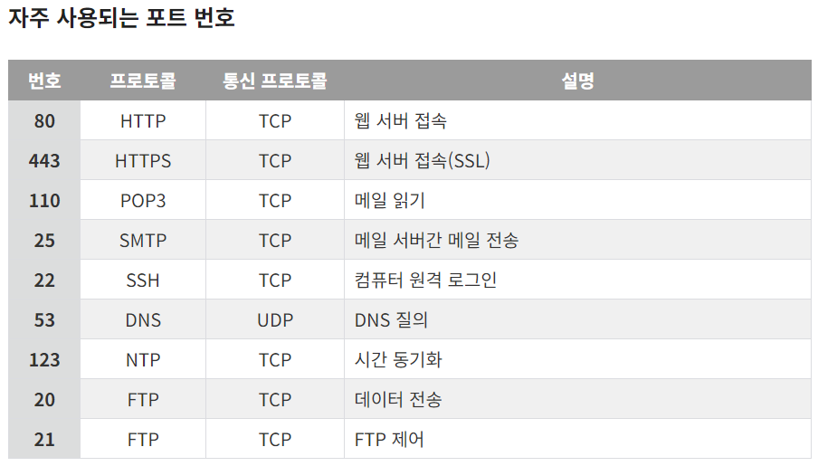

- AWS
    
    Amazon Web Services.로 아마존에서 제공하는 클라우드 컴퓨팅 플랫폼을 구성하는 원격 컴퓨팅 서비스 모음
    
    다양한 IT리소스에 대한 원격 엑세스를 제공함
    
    제공하는 서비스에는 컴퓨팅 성능, 스토리지 , 데이터베이스 ,에플리케이션 개발, 배포 및 관리를 위한 다양한 도구와 서비스가 포함됨
    
    장점: 확장성, 비용효율성, 안정성, 유연성, 보안, 도달범위
    
    단점: 복잡성, 비용, 인터넷 의존성, 공급업체 종송, 보안 문제, 통제력 부족
    
- 리전과 가용영역
    
    ```
    AWS Cloud 내에는 IDC의 집합인 'Region'이 존재하며 Region은 2개의 'Availability Zone(AZ)'으로 이루어져 있다.
    ```
    
    리전: 인프라를 지리적으로 나누어 배포한 것. 나라별 단위. 사용자가 리전을 가깝게 해야 network latency를 최소화할 수 있음(AWS는 전세계 23개의 리전을 보유하고 있으며 각각의 리전들은 AWS 백본 네트워크에 연결되어 있음)
    
    가용영역(이하 AZ): 각 리전 내에 격리된 위치. 개별 데이터센터로 구성되어 있음. 리전이 동일해도 다른 가용 영역에 AWS 서비스를 각각 배치했다면 물리적으로 복수의 데이터센터를 사용하는 것이 됨. 
    
    복수의 AZ에 걸쳐 인스턴스를 배포했다면 하나의 인스턴스에 장애가 발생한 경우를 대비해 나머지 다른 영역의 인스턴스가 요청을 이어받아 처리할 수 있도록 애플리케이션을 설계함.
    
- 서브네팅
    
    IP 주소 관리와 네트워크 구성을 효율적으로 할 수 있도록 도와주는 기술
    
    서브네팅: 하나의 큰 네트워크를 필요한 만큼 네트워크 영역으로 나누어 사용하는 방식
    
    서브넷: 나누어진 네트워크
    
    **서브넷 마스크( Subnet Mask )**
    
    네트워크 아이디와 호스트 아이디를 구별하는 구분자
    
    **서브넷팅의 목적**
    
    - IP 주소 낭비를 방지
    - 원본 네트워크를 여러개의 네트워크로 분리하는 계산작업을 통해 네트워크 할당
- 라우팅
    
    네트워크에서 최적의 경로를 선택하는 프로세스
    
    라우팅은 네트워크가 정체 없이 최대한 많은 용량을 사용할 수 있도록 데이터 트래픽을 관리함으로써, 네트워크 장애를 최소화함
    
    라우팅, 포워딩을 수행하는 라우터는 컴퓨팅 디바이스와 네트워크를 다른 네트워크에 연결하는 네트워킹 디바이스
    
    **정적 라우팅**
    
    네트워크 관리자가 정적 테이블을 사용하여 네트워크 경로를 수동으로 구성하고 선택
    
    **동적 라우팅**
    
    실제 네트워크 조건에 따라 런타임에 라우팅 테이블을 만들고 업데이트
    
    라우팅 프로토콜을 사용하여 소스에서 대상까지 가장 빠른 경로를 찾으려고 시도
    
    **주요 라우팅 프로토콜’**
    
    - 내부 게이트웨이 프로토콜
    - Routing information protocol
    - open shortest path first 프로토콜
    - 외부 게이트웨이 프로토콜
    - Border Gateway Protocol
    
    **라우팅 알고리즘**
    
    - distance vector algorithm
        - bellman-ford algo
    - link state algorithm
        - dijkstra algo
    
    **로드 밸런싱**
    
    경우에 따라 라우터가 여러 경로를 사용하여 동일한 데이터 패킷의 여러 사본을 전송할 수도 있음. 이 방법을 통해 데이터 손실로 인한 오류를 줄이고 이중화를 구현하고 트래픽 볼륨을 관리
    
- VPC
    
   
    
    **Virtual Private Cloud**
    
    사용자가 정의하는 aws 계정 사용자 전용 가상 네트워크
    
    VPC는 Region에 하나씩 존재
    
    다른 Region과 걸쳐서 확장이 불가능, 각 Region에 종속되며 RFC1918이라는 사설 IP 대역에 맞추어 설계해야 함
    
- 사설 IP 주소
    
    VPC에서 사용하는 사설 IP 대역:
    
    ```
    10.0.0.0 - 10.255.255.255 (10/8 prefix)
    172.16.0.0 - 172.31.255.255 (172.16/12 prefix)
    192.168.0.0 - 192.168.255.255 (192.168/16 prefix)
    ```
    
    AWS VPC는 온프레미스와 동일한 대역의 사설IP를 이용해 범위 내에서 vpc의 ipv4 CIDR영역을 설정함
    
    한 Region안에 VPC를 여러개 생성할 때 서로 IP는 겹치면 안됨.
    
    (DNS IP를 잡지 못하는 에러가 발생할 가능성이 있음)
    
    원래 규정된 사설IP 범위와는 다르게 aws에는 /16~/28비트의 서브넷 마스크만을 허용
    
    한번 설정된 IP 대역은 수정할 수 없으며 각각의 VPC는 독립적이기 때문에 서로 통신 불가(VPC peering survice통해 통신가능)
    
- 포트포워딩
    
    외부에서 접속한 IP 주소와 포트 번호를 내부 호스트에 다시 매핑하는 것
    
    1. 포트 포워딩 추가
        
        명령어:
        
        ```
        sudo iptables -t nat -A PREROUTING -i eth0 -p tcp --dport 80 -j REDIRECT --to-port 5005
        ```
        
    2. 포트 포워딩 확인
        
        명령어:
        
        ```
        sudo iptables -t nat -L --line-numbers
        ```
        
    3. 포트 포워딩 삭제
        
        명령어:
        
        ```
        sudo iptables -t nat -D PREROUTING {삭제할 번호}
        ```
        
    
- NAT 프로토콜
    
    NAT: network address traslation
    
    - 로컬 네트워크에서 나가는 모든 데이터그램은 동일한 NAT IP 주소를 사용하며, 포트 번호가 다름
    - 로컬 네트워크 내부에서의 데이터그램은 10.0.0.0/24 대역의 주소를 사용하여 출발지와 목적지를 나타냄
    
    NAT 논란
    
    - 라우터는 3계층까지만 처리해야 한다는 주장에 반함
    - 종단 간 논리 위반
    - NAT 가능성을 애플리케이션 설계자가 고려해야 함
- 포트 번호
    
    Port는 논리적 접속장소를 뜻하며 인터넷 프로토콜인 TCP/IP를 사용할 때 클라이언트 프로그램이 네트워크 상의 특정 서버 프로그램을 지정하는 방법으로 사용
    
    하나의 컴퓨터 내에서 여러 개의 서버가 실행될 때 포트 번호를 통해 대상 IP 기기의 특정 애플리케이션 서버에 접속할 수 있도록 함
    
    포트 번호는 0 ~ 65,535까지 사용가능
    
    이 중에서 0~1023번 까지의 포트 번호는 주요 통신을 위한 규약에 따라 이미 정해져 있는 포트

    
